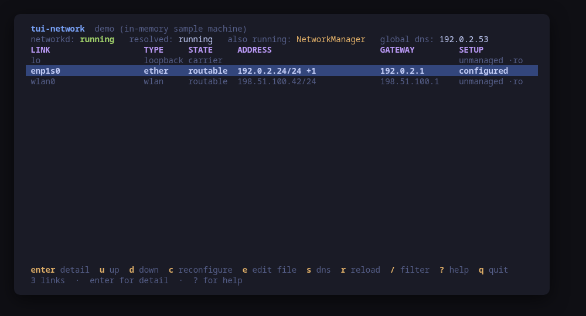
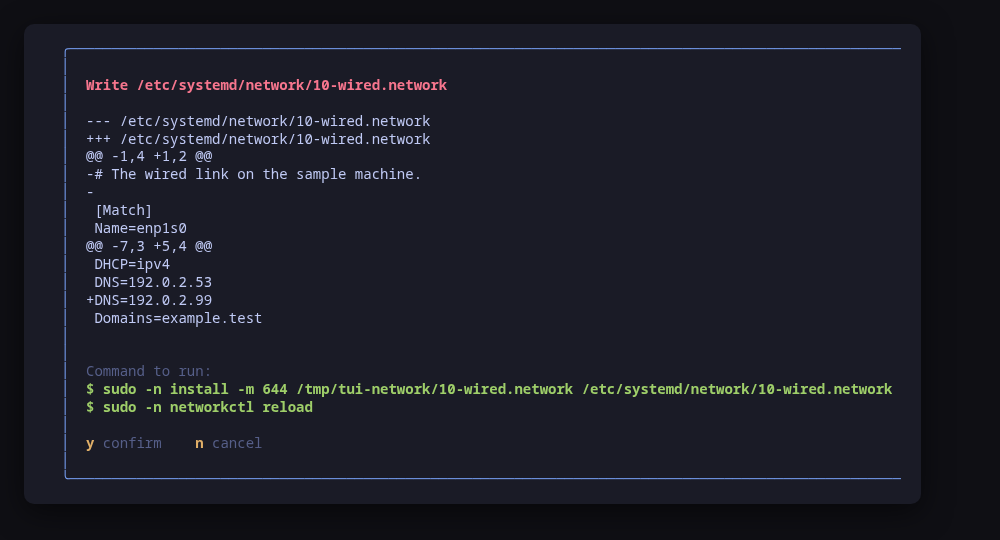
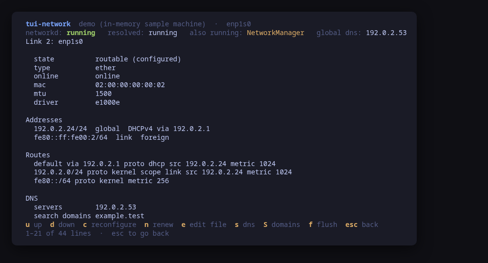
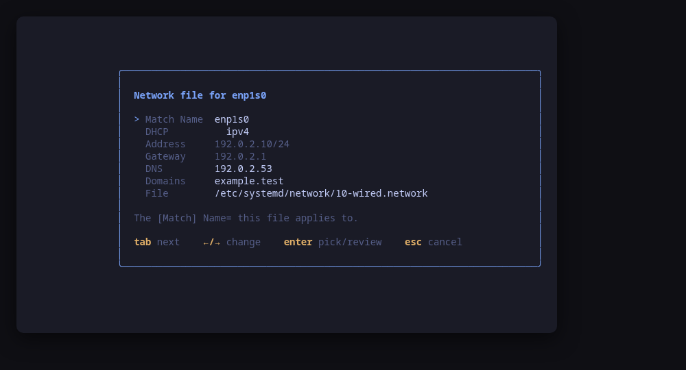
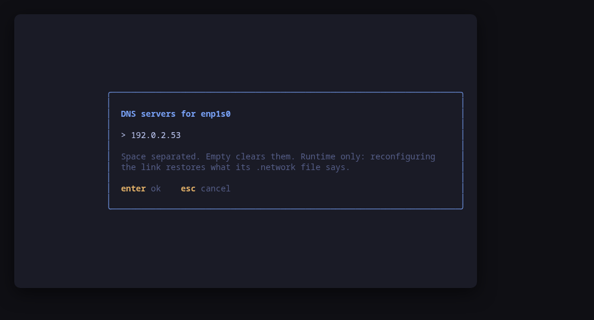
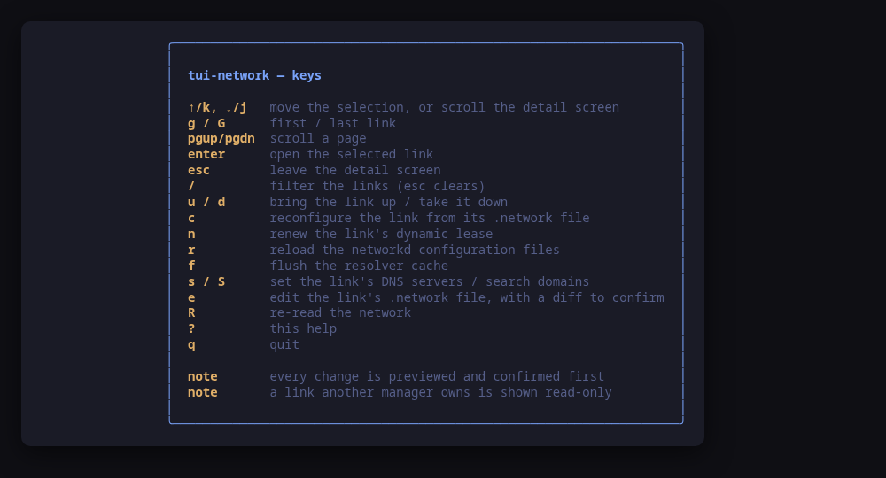

[](https://scorecard.dev/viewer/?uri=github.com/tui-tools/tui-network)
[](https://www.bestpractices.dev/projects/14368)

> **Beta.** The family is days old and still changing. Package names, flags
> and keys may move without notice until 1.0. Pin versions, and report what
> breaks.

A terminal UI for the machine's network. It shows the links you actually have —
with their addresses, routes, DNS and the `.network` file behind each one — and
**previews the exact command line of every change before running it**.

`systemd-networkd` has no TUI: you get `networkctl`, `resolvectl`, `ip` and a
text editor, in four different terminals. `tui-network` puts them on one screen,
in the [Omarchy](https://omarchy.org) visual style.



> **Status: early, under validation.** An independent tool that follows the
> Omarchy visual style; it is **not** part of the Omarchy project and not
> endorsed by its maintainers. Expect rough edges.

## Install

<!-- install:start -->
<!-- Generated by tui-kit/tools/render-install.py from tool.json. -->
<!-- Edit the manifest, then run `make readme`. -->

### Arch Linux

Needs the tui-tools repository, which is a [one-time
setup](https://tui-tools.github.io/install/).

The one-liner detects the distribution and adds the repository and its signing
key:

```sh
curl -fsSL https://pkgs.tui.tools/install.sh | sh
```

Piping a script into a shell is not this family's style, so here is the same
setup by hand — read it, or read the script first with `curl -fsSL
https://pkgs.tui.tools/install.sh -o install.sh`:

```sh
curl -fsSL -o /tmp/tui-tools.asc https://pkgs.tui.tools/pubkey.asc
sudo pacman-key --add /tmp/tui-tools.asc
sudo pacman-key --lsign-key \
  "$(gpg --show-keys --with-colons /tmp/tui-tools.asc | awk -F: '/^fpr:/{print $10; exit}')"
printf '[tui-tools]\nServer = https://pkgs.tui.tools/arch/$arch\n' \
  | sudo tee -a /etc/pacman.conf
sudo pacman -Sy
```

Then, and for every other tool in the family:

```sh
sudo pacman -S tui-network
```

Upgrades then arrive with the rest of your system updates.

### Debian and Ubuntu

Needs the tui-tools repository, which is a [one-time
setup](https://tui-tools.github.io/install/).

The one-liner detects the distribution and adds the repository and its signing
key:

```sh
curl -fsSL https://pkgs.tui.tools/install.sh | sh
```

Piping a script into a shell is not this family's style, so here is the same
setup by hand — read it, or read the script first with `curl -fsSL
https://pkgs.tui.tools/install.sh -o install.sh`:

```sh
sudo install -d -m 0755 /etc/apt/keyrings
curl -fsSL https://pkgs.tui.tools/pubkey.asc \
  | sudo gpg --dearmor -o /etc/apt/keyrings/tui-tools.gpg
echo "deb [signed-by=/etc/apt/keyrings/tui-tools.gpg] https://pkgs.tui.tools/deb stable main" \
  | sudo tee /etc/apt/sources.list.d/tui-tools.list
sudo apt update
```

Then, and for every other tool in the family:

```sh
sudo apt install tui-network
```

Upgrades then arrive with the rest of your system updates.

### Fedora and RHEL

Needs the tui-tools repository, which is a [one-time
setup](https://tui-tools.github.io/install/).

The one-liner detects the distribution and adds the repository and its signing
key:

```sh
curl -fsSL https://pkgs.tui.tools/install.sh | sh
```

Piping a script into a shell is not this family's style, so here is the same
setup by hand — read it, or read the script first with `curl -fsSL
https://pkgs.tui.tools/install.sh -o install.sh`:

```sh
sudo rpm --import https://pkgs.tui.tools/pubkey.asc
sudo curl -fsSL -o /etc/yum.repos.d/tui-tools.repo https://pkgs.tui.tools/rpm/tui-tools.repo
sudo dnf makecache
```

Then, and for every other tool in the family:

```sh
sudo dnf install tui-network
```

Upgrades then arrive with the rest of your system updates.

### Any distribution, static binary

```sh
curl -fsSL https://github.com/tui-tools/tui-network/releases/download/v0.3.0/tui-network_0.3.0_linux_amd64.tar.gz | tar -xz tui-network
sudo install -m0755 tui-network /usr/local/bin/tui-network
```

One static binary. Verify it against checksums.txt from the same release.

### From source

```sh
git clone https://github.com/tui-tools/tui-network
cd tui-network && make build
sudo install -m0755 bin/tui-network /usr/local/bin/tui-network
```

Needs Go 1.27 or newer.

Not packaged for these yet; the static binary works everywhere in the meantime.

### Arch Linux (AUR) — coming soon

```sh
paru -S tui-network-bin
```

The -bin package installs the released static binary.

### openSUSE — coming soon

Needs the tui-tools repository, which is a [one-time
setup](https://tui-tools.github.io/install/).

```sh
sudo zypper install tui-network
```

The rpm repository is shared with dnf; zypper support is not tested yet.

### Verify a download

Every release of `tui-network` ships a `checksums.txt`. Check an archive
against it before installing:

```sh
sha256sum -c checksums.txt --ignore-missing
```
<!-- install:end -->

One static binary, no daemon, no state of its own. Nothing keeps running after
you quit.

## Try it without root

```sh
tui-network --demo
```

`--demo` runs against a sample machine: a loopback, a wired link networkd
configured over DHCP, and a wireless link NetworkManager owns. Every key works,
every command is built and previewed for real, and nothing touches your system.
Its DHCP screen shows a sample dnsmasq; `--demo-dhcp networkd` swaps in a
sample router whose DHCP is `systemd-networkd`'s own.

## Every change is previewed



`y` runs the commands shown, `n` does not. There is no other path to a change:
the UI hands the same values to the preview and to the runner, so what you read
is what executes. Anything that writes a file is more than one command — the
file is staged in a temporary directory, diffed against what is on disk, then
installed and reloaded — and every line is on screen before any of them runs.
Building a VLAN or a bridge writes several files at once, and they are all in
the same diff and the same list of commands.

## One link, in full



`enter` opens the selected link: its addresses and where each came from, the
routes attached to it, its DNS servers and search domains, its DHCP lease, the
`.network` file that configures it, and what systemd-networkd has been saying
about it in the journal.

## The router's DHCP and DNS

`D` opens the DHCP screen: the piece a router profile needs on top of links,
addresses and routes. It reads whichever DHCP server the machine runs — dnsmasq,
ISC Kea, or `systemd-networkd`'s own, detected — and shows the server, the pools it hands out, the
reservations that pin a host to an address, and the leases it has granted, each
with its MAC, address, hostname and how long it has left. dnsmasq serves DNS and
DHCP from one process, so the screen says so: on such a router the resolver view
on the links screen is only what systemd-resolved reports.

On a dnsmasq machine four changes are offered, each previewed like every other:
add a reservation (`a`, written to a drop-in of the tool's own,
`/etc/dnsmasq.d/tui-network.conf`), remove one (`x`), adjust a pool's range
(`p`), and edit the DHCP and DNS options (`o`). Each is a file edit shown as a
unified diff, then installed and applied — a reservation with `systemctl reload
dnsmasq`, a pool range or an options change with a restart, which the dialog
says interrupts service. Kea is read-only for now, and a machine with neither
server shows an empty screen that explains why.

`o` opens a guided form for what every router deployment touches on day one:
the DNS servers the leases advertise (option 6), the advertised gateway
(option 3), the local domain, and the upstream `server=` forwarders dnsmasq
resolves through. The screen's summary shows the effective values merged
across every file dnsmasq reads, but the form seeds from — and the write
regenerates, in full — a second drop-in of the tool's own,
`/etc/dnsmasq.d/50-tui-network.conf`, so a line the administrator maintains by
hand is never rewritten. Empty DNS and gateway fields render no option at all:
with the option absent dnsmasq advertises its own address, which is what a
router wants and stays right if it is ever renumbered. The change is applied
with a restart, because dnsmasq does not re-read configuration files on
SIGHUP.

### systemd-networkd's own DHCP server

A router does not have to install a DHCP server at all: `systemd-networkd` has
one, turned on by `DHCPServer=yes` in the LAN's `.network` unit and configured
by that unit's `[DHCPServer]` section. That is what the Omarchy Router profile
runs, and `tui-network` drives it the same way it drives `dnsmasq`.

The screen derives the pool the way `systemd` does: from the unit's `Address=`
and its `PoolOffset=`/`PoolSize=`, where a zero offset means the first address
after the subnet address and a zero size means the rest of the subnet up to the
broadcast address. Alongside it are the default lease time, what the leases
advertise — DNS, NTP, the router and the domain — the `[DHCPServerStaticLease]`
reservations, and the leases the server has actually offered, read from
`networkctl status`, which is where `systemd-networkd` publishes them (the
JSON output does not carry them; the list arrived in `systemd` 246).

All four changes are offered. Each one is rendered into a single drop-in of the
tool's own, `/etc/systemd/network/<unit>.network.d/50-tui-network-dhcp.conf`,
shown as a unified diff, installed with `install -D -m 644` and applied with
`networkctl reload`. The unit itself — the file `omarchy-router-nics` writes —
is never rewritten.

Two `systemd` details show through, because they change what the tool can
honestly offer:

- A drop-in's list assignment *adds* to the unit's, so the drop-in clears each
  list before it sets it (`DNS=` then `DNS=…`). That is why the options form
  opens on the values in effect across the unit and the drop-in rather than on
  the drop-in alone: it rewrites the whole answer.
- A `[DHCPServerStaticLease]` section is additive and cannot be taken back by a
  drop-in. A reservation `tui-network` wrote is removed by `x`; one the unit
  itself declares is refused, with the file to edit named, instead of writing a
  drop-in that would do nothing.

`[DHCPServer]` has no key for the domain — `EmitDomains=` belongs to
`[IPv6SendRA]`, which is router advertisement rather than DHCP — so the domain
is sent as the raw option it is, `SendOption=15:string:<domain>`.

`tui-network --demo --demo-dhcp networkd` drives a sample router of this shape,
with the same units, the same drop-in and the same previews as the real thing.

## The router's gateways and failover

`w` opens the Gateways screen, for a router with more than one uplink. It reads
the default routes from `ip -j route` — a multipath default expanded into one
row per next hop — and lists each candidate gateway with its interface, address
and metric, marking the one the kernel is using now: the lowest-metric default
of its family. An optional read, `ip -j route get`, resolves how each gateway is
reached, so a row shows whether its own interface is the egress. None of that
touches the machine; it is all a route lookup.

Two changes are offered, each previewed with the exact command. `s` sets the
default route to the selected uplink, and `x` fails over to the top standby —
both run `ip route replace default via <gw> dev <if> metric <n>` at a metric
that wins the kernel's lowest-metric race, so the chosen uplink becomes the
default at once. That is a live change: it re-points the default route now, and
the dialog says so, because it can drop the session it runs over. On a
`systemd-networkd`-managed link, `P` also writes a persistent `[Route]` drop-in
under `/etc/systemd/network/<file>.d/50-tui-gateway.conf`, shown as a diff and
applied with `networkctl reload`, so the priority survives a reconfigure. An
uplink another manager owns gets the live switch only, and the screen says why.

## Usage

```sh
tui-network                       # drive the real network
tui-network --demo                # sample machine, no privileges needed
tui-network --demo --demo-dhcp networkd   # …whose DHCP is networkd's own
tui-network --check               # read the network, print JSON, exit
tui-network --report              # print what a bug report needs, exit
tui-network --theme ~/mytheme/colors.toml
tui-network --sudo ""             # run the commands directly (as root)
tui-network --version
```

### `--check`, for scripts and tests

`--check` is the non-interactive read path: it loads the network through the
same backend the UI would use, prints the parsed model as JSON and exits 0, or
exits 1 with the reason if the backend cannot be read. No UI, and it never
builds or runs a mutation, so it is safe to run anywhere.

```console
$ tui-network --check | head -12
{
  "tool": "tui-network",
  "version": "0.1.0",
  "backend": "systemd-networkd",
  "describe": "networkctl via /usr/bin/sudo -n",
  "running": true,
  "resolvedRunning": true,
  "links": 3,
  "managed": 1,
  "routes": 5,
  "configFiles": 1,
```

It exists so a test can assert on what the tool *parsed* rather than on what it
painted — that the link count matches `networkctl list`, that the route count
matches `ip -j route`, and, on a NetworkManager machine, that not one link came
back writable.

[tui-lab](https://github.com/tui-tools/tui-lab) uses it to test this tool
against real machines on Ubuntu, Fedora and Omarchy Server; the assertions live
in [`test/smoke.sh`](test/smoke.sh).

### `--report`, for bug reports

`--report` prints, in one block, everything a maintainer has to ask for
otherwise: the tool and kit versions, the systemd the version probe read off
`networkctl`, which of the two parsers that version selects, whether the link
up and down keys existed at all, the distribution, the kernel, the terminal,
the theme, the escalation prefix, and whether the running binary came from a
package. It needs no privileges and reads no network, so it works on the
machine where the bug is — including one with no `networkctl` at all, which is
itself a thing worth reporting.

```console
$ tui-network --report
tui-network 0.1.0 (kit v0.2.9)
backend: systemd-networkd 257
mode: live
distro: fedora 42 (Fedora Linux 42 (Workstation Edition))
kernel: 6.19.14-108.fc42.x86_64
arch: x86_64
locale: en_US.UTF-8
term: xterm-256color
theme: tokyo-night
sudo: sudo -n
root: no
binary: /usr/bin/tui-network (packaged)
reads: networkctl --json
link up/down: available
```

The block is written to be published as it is: it carries no hostname, user
name, home path or address, and no environment variable beyond `LANG`,
`LC_ALL`, `TERM` and `TERM_PROGRAM`. A binary living under your home directory
is reported as being there without naming the path. Nothing about your network
is in it — not an interface name, not an address, not a DNS server. `--report`
works with `--demo` too, where it says so on the `mode` line.

The bug form asks for this block first — see
[`.github/ISSUE_TEMPLATE/bug_report.yml`](.github/ISSUE_TEMPLATE/bug_report.yml).

Reading the network needs no privileges at all — `networkctl list`,
`resolvectl dns` and `ip route` answer to any user, and `tui-network` never
escalates to look. Changing something does: it uses `sudo -n`, which never
prompts, so run `sudo -v` in another terminal first, or start `tui-network` with
sudo.

## What it can do to your machine

Every one of these is previewed and confirmed first, and every one is refused on
a link systemd-networkd does not manage.

| Key | What runs |
| --- | --- |
| `u` | `networkctl up <link>` |
| `d` | `networkctl down <link>` |
| `c` | `networkctl reconfigure <link>` |
| `n` | `networkctl renew <link>` |
| `r` | `networkctl reload` |
| `f` | `resolvectl flush-caches` |
| `s` | `resolvectl dns <link> <servers…>` |
| `S` | `resolvectl domain <link> <domains…>` |
| `e` | `install -m 644 <staged file> /etc/systemd/network/<name>.network`, then `networkctl reload` |
| `V` | one `install -m 644` per file — the `.netdev` unit and each member's `.network` — then a single `networkctl reload` |
| `X` | `rm -f -- /etc/systemd/network/<name>.netdev`, one `install -m 644` per member file, then `networkctl reload` |

Nothing else. There is no code path that writes to `/etc` other than that
`install` and that `rm`, and both refuse any destination outside
`/etc/systemd/network` or any name that does not end in `.network` or
`.netdev`. The `rm` is narrower still: it only ever names a `.netdev` unit, so
no mistake there can delete a link's configuration.

### VLANs and bridges

`V` on the links screen asks what to build, then opens a form:

- **vlan** — a name, the parent link (picked from the links `systemd-networkd`
  manages) and an 802.1Q id between 1 and 4094.
- **bridge** — a name and the member links, ticked in a list with `space`.

What gets written is two things at once, because neither half works alone:

- `/etc/systemd/network/20-<name>.netdev`, declaring the device
  (`[NetDev] Name=`, `Kind=`, and `[VLAN] Id=` for a VLAN);
- a `VLAN=<name>` line in the parent's `.network` file, or a `Bridge=<name>`
  line in each member's — added to the file the link already has, keeping
  everything else in it. A link with no `.network` file yet gets a minimal one
  under `/etc/systemd/network`.

All of it is shown as **one unified diff over every file**, followed by the
exact commands: an `install -m 644` per file, then a single `networkctl reload`
at the end — never one in the middle, which is where networkd would see half a
device.

> **This can lock you out.** Enslaving a link hands its addresses to the new
> device. If you are connected over the link you are re-parenting, you will lose
> the session. The confirm dialog says so, naming the links involved, before
> anything is written.

A name that is already taken — by another `.netdev` unit, by an existing link,
or by a unit file already in place — is refused before a plan is built, and so
is a member link `systemd-networkd` does not manage.

`X` is the mirror image, on a device `tui-network` itself created: the `.netdev`
unit is deleted and the member lines that named it are stripped, again as one
diff, one confirm and one reload. A unit somebody else wrote is shown but never
removed — the tool only takes back what it put there, which it knows from the
`# Written by tui-network` banner it writes into every file it generates.

## Keys

| Key | Action |
| --- | --- |
| `↑`/`k`, `↓`/`j` | Move the selection, or scroll the detail screen |
| `g` / `G` | First / last link |
| `pgup` / `pgdn` | Scroll a page |
| `enter` | Open the selected link |
| `esc` | Leave the detail screen |
| `/` | Filter links (matches any column; `esc` clears) |
| `u` / `d` | Bring the link up / take it down |
| `c` | Reconfigure the link from its `.network` file |
| `n` | Renew the link's dynamic lease |
| `r` | Reload the networkd configuration files |
| `f` | Flush the resolver cache |
| `s` / `S` | Set the link's DNS servers / search domains |
| `e` | Edit the link's `.network` file, with a diff to confirm |
| `V` | Create a VLAN or a bridge: a `.netdev` unit and its member lines |
| `X` | Remove the selected VLAN or bridge, if `tui-network` wrote its unit |
| `D` | The router's DHCP screen: pools, reservations and leases |
| `a` / `x` / `p` | On the DHCP screen: add / remove a reservation, adjust a pool's range |
| `o` | On the DHCP screen: advertised options, upstream forwarders (dnsmasq) or lease time (networkd) |
| `w` | The Gateways screen: the uplinks and the default route |
| `s` / `x` | On the Gateways screen: set the default / fail over to a standby |
| `P` | On the Gateways screen: make an uplink's priority persistent |
| `R` | Re-read the network |
| `?` | Help |
| `q` | Quit |

In the **network file**, **VLAN** and **bridge** forms: `tab` / `shift+tab` move
between fields, `←`/`→` cycle a choice, `enter` opens a picker on a choice
field and submits from a text field, `esc` cancels. In the bridge's member
list, `space` ticks a link and `enter` accepts the set.







## Links another manager owns

On a machine running NetworkManager, `networkctl` still lists every link and
reports all of them `unmanaged`. `tui-network` shows them — with their
addresses, routes and DNS, read from the kernel and from systemd-resolved — and
refuses every action on them, naming NetworkManager as the reason.

That is the whole rule: a link `systemd-networkd` does not manage is a link this
tool will not touch, because a change to it would either be undone on the next
reconfigure or fight with whoever does own it.

## What v0.1 can do

- Read the links from `networkctl --json=short list`, falling back to the
  columns of `networkctl list` on an older systemd or a machine where networkd
  is not running.
- Show state, operational state, type, kind, addresses, gateway, MAC, MTU and
  driver, with the routing table from `ip -j route` and the resolver's view from
  `resolvectl dns` and `resolvectl domain`.
- Open one link in full: addresses and their source, routes, DNS, search
  domains, DHCP lease, the `.network` file that configures it, and the
  `systemd-networkd` journal filtered to that link.
- List the `.network` files from systemd's search path, parsed and matched to
  the link each one configures.
- Bring a link up or down, reconfigure it, renew its lease, reload the
  configuration, flush the resolver cache, and set DNS servers or search domains
  at runtime.
- Write a `.network` file from a guided form — match, DHCP mode, static address,
  gateway, DNS servers, search domains — reviewed as a unified diff, installed
  with `install -m 644` and applied with `networkctl reload`.
- Create a VLAN or a bridge: a `.netdev` unit plus the `VLAN=` or `Bridge=`
  line in every member's `.network` file, reviewed as one unified diff over all
  of them, installed file by file and applied with a single `networkctl
  reload` — and remove one again the same way, if `tui-network` wrote it.
- Read the router's DHCP server — dnsmasq, ISC Kea, or `systemd-networkd`'s own
  `[DHCPServer]` — detected: its pools, reservations and leases, from the lease
  file, the configuration, or `networkctl status`.
- On dnsmasq, add or remove a reservation and adjust a pool's range, each
  reviewed as a unified diff and applied with a `systemctl reload` or `restart`.
- On `systemd-networkd`, do the same through one drop-in per unit: the pool as
  `PoolOffset=`/`PoolSize=` computed from the LAN's subnet, the static leases as
  `[DHCPServerStaticLease]` sections, and the advertised DNS, NTP, router,
  domain and lease time — installed and applied with `networkctl reload`.
- On dnsmasq, set what DHCP advertises — DNS servers (option 6), gateway
  (option 3) and domain — and the upstream `server=` forwarders, through a
  guided form that rewrites only a drop-in of the tool's own.
- Enumerate a multi-uplink router's gateways from the default routes, mark the
  active one, and probe each uplink's reachability with `ip -j route get`.
- Switch the default route or fail over to a standby uplink, live with `ip route
  replace` and persistently with a `systemd-networkd` drop-in on a managed link,
  each previewed with the exact command.
- Show a link another manager owns as read-only, with the reason.
- Follow the active Omarchy theme, and respect `NO_COLOR`.

## What v0.1 cannot do

- **No NetworkManager backend.** Its links are read and shown, never changed.
  The `network.Backend` interface is where one would go; nothing in the UI names
  `networkctl`.
- **No netplan**, no `wpa_supplicant`, no wireless scanning or joining.
- **Only VLANs and bridges among the `.netdev` kinds.** Bonds, VXLANs, tunnels
  and the rest are shown as links, and a unit `tui-network` did not write is
  never edited or removed. There is no key that changes a device after it
  exists: remove it and build it again.
- **No free-form file editing.** The form writes the settings it knows; the file
  is shown whole on the detail screen, and anything else is a job for `$EDITOR`.
  A file the form rewrites loses its comments, which the diff shows before you
  agree to it.
- **No live counters**, no traffic graph, no `ping`, no `lldp` view.
- Routes are read-only: there is no key that adds or deletes one.
- **DHCP on Kea is read-only.** Its pools, reservations and leases are shown; the
  add, remove and pool-range keys are offered on dnsmasq and on
  `systemd-networkd`, not on Kea.
- **A networkd static lease cannot be removed from the unit.** A drop-in adds
  `[DHCPServerStaticLease]` sections and cannot take one back, so only the ones
  `tui-network` wrote are removable, and a networkd lease has no hostname:
  `[DHCPServerStaticLease]` has no key for one.
- **No DHCP server lifecycle.** The DHCP screen edits reservations and pool
  ranges; it does not enable, start or install a server, or create a pool from
  nothing.

## Compatibility

<!-- compat:start -->
<!-- Generated by tui-kit/tools/render-compat.py from tool.json. -->
<!-- Edit the manifest, then run `make readme`. -->

`tui-network` probes its backend once at startup and shows the version in the
header. A version nobody has tested is marked `(untested)` there rather than
hidden; one below the minimum is marked as such and the tool still runs.

### systemd-networkd

| | |
| --- | --- |
| Binary | `networkctl` |
| Version read with | `networkctl --version` |
| Minimum | 245 |
| Tested | `255`, `257`, `259`, `261` |
| Version-gated features | `json-status` (since 249), `link-up-down` (since 249), `dhcp-server-leases` (since 246), `dhcp-static-lease` (since 249) |

| Versions | What changes |
| --- | --- |
| `<249` | `networkctl --json` does not exist, so the columns of `networkctl list` and the `Key: value` block of `networkctl status` are parsed instead; addresses carry no prefix length there, and the DHCP lease clock is not reported at all |
| `<249` | `networkctl up` and `down` do not exist; the keys are dropped from the hint bar and reconfigure is offered in their place |
| `>=245` | no released systemd emits JSON from `resolvectl status`, so DNS servers and search domains are read from the text output of `resolvectl dns` and `resolvectl domain` |
| `>=245` | the Gateways screen (w) reads the default routes from `ip -j route` (multipath expanded per next hop) and reachability from `ip -j route get`; the default-route switch and failover run `ip route replace` live, and a managed link also gets a persistent `[Route]` drop-in reloaded with `networkctl` |
| `>=245` | VLANs and bridges (V) are written as a .netdev unit under /etc/systemd/network plus a VLAN= or Bridge= line in each member's .network file, previewed as one multi-file diff, installed with `install -m 644` and applied with a single `networkctl reload`; X removes a unit tui-network wrote with `rm -f` |
| `>=245` | the DHCP screen (D) also reads systemd-networkd's own DHCP server, the one a `[DHCPServer]` section in a .network unit turns on: the pool derived from `Address=` with `PoolOffset=`/`PoolSize=`, the lease time, the advertised DNS, NTP, router and domain, and the static leases |
| `>=245` | a change to that server is written to a drop-in of the tool's own (`<unit>.network.d/50-tui-network-dhcp.conf`), rendered whole and applied with `networkctl reload`; the unit itself is never rewritten, and each advertised list is cleared before it is set because a drop-in's `DNS=` adds to the unit's |
| `>=245` | `[DHCPServer]` has no key for the domain (`EmitDomains=` belongs to `[IPv6SendRA]`), so tui-network emits it as the raw option it is, `SendOption=15:string:<domain>` |
| `<246` | `networkctl status` does not print the "Offered DHCP leases" list (systemd 246 added it), so a networkd DHCP server shows its pool and its static leases but no live ones |
| `<249` | `[DHCPServerStaticLease]` does not exist (systemd 249 added it), so a static lease written on an older systemd is read back by the screen but ignored by the server |

### dnsmasq

| | |
| --- | --- |
| Binary | `dnsmasq` |
| Version read with | `dnsmasq --version` |
| Minimum | 2.80 |
| Tested | none yet |

| Versions | What changes |
| --- | --- |
| `>=2.80` | the DHCP screen reads the lease file (/var/lib/misc/dnsmasq.leases), the `dhcp-range` pools and `dhcp-host` reservations from the configuration, and dnsmasq serves DNS and DHCP from one process, so the resolver view on the links screen is only what systemd-resolved reports |
| `>=2.80` | reservations tui-network adds are written to a drop-in of its own (/etc/dnsmasq.d/tui-network.conf) and applied with `systemctl reload dnsmasq`; a pool range change needs `systemctl restart dnsmasq`, which briefly interrupts DNS and DHCP |
| `>=2.80` | Advertised DHCP options (DNS, gateway, domain) and upstream server= forwarders are edited through the tool's own drop-in (/etc/dnsmasq.d/50-tui-network.conf), regenerated whole; lines the tool does not own are never touched. Applying restarts dnsmasq. |

### kea

| | |
| --- | --- |
| Binary | `kea-dhcp4` |
| Version read with | `kea-dhcp4 -V` |
| Minimum | 2.0.0 |
| Tested | none yet |

| Versions | What changes |
| --- | --- |
| `>=2.0.0` | the DHCP screen reads Kea's pools and host reservations from its JSON config (/etc/kea/kea-dhcp4.conf, // and /* */ comments stripped) and its leases from the memfile CSV (/var/lib/kea/kea-leases4.csv); Kea is read-only here, so the add, remove and pool-range keys are not offered |

The tested versions are generated from `compat/results.jsonl`, which the tool's
own smoke test appends to when it runs against a real machine in
[tui-lab](https://github.com/tui-tools/tui-lab).
<!-- compat:end -->

## Configuration

`/etc/tui-network/config.toml`, then `~/.config/tui-network/config.toml` (the
user file overrides the machine-wide one), then `TUI_NETWORK_*` in the
environment. Flags override everything. See
[`examples/config.toml`](examples/config.toml).

```toml
# Privilege escalation prefix; "" runs the command directly.
sudo = "sudo -n"

# Path to an Omarchy-style colors.toml; empty follows the active theme.
theme = ""
```

## Theme

The default palette is **Tokyo Night**. On Omarchy, the tool reads the active
desktop theme from `~/.config/omarchy/current/theme/colors.toml` and follows it.
`TUI_THEME` or `--theme` override; `NO_COLOR` drops color and keeps layout. The
rules live in [tui-kit](https://github.com/tui-tools/tui-kit#theme-rules).

## Architecture

The UI never builds a `networkctl` command line. It talks to
`internal/network.Backend`, which returns a manager-neutral model:

```
Model{Running, ResolvedRunning, ForeignManager, Links, Routes, ConfigFiles,
      NetdevFiles}
Link{Index, Name, Type, Kind, Setup, Operational, MAC, MTU, Driver,
     Addresses, Gateways, DNS, SearchDomains, NetworkFile, DHCP,
     Managed, ReadOnlyReason}
ConfigFile{Path, Raw, Settings, Links, MatchName}
NetdevFile{Path, Raw, Settings, Name, Kind, Owned}
```

`internal/networkd` is the only package that starts a process. It drives four
programs through four kit runners — `networkctl`, `resolvectl`, `ip` and
`journalctl` — plus `install` for the writes and `rm` for the one removal, and
[`check-exec.sh`](https://github.com/tui-tools/tui-kit/blob/main/tools/check-exec.sh)
fails the build if any other package imports `os/exec`.

Mutations are `runner.Command` values produced by the backend. The UI shows them
and, on confirmation, hands the same ones back to the
[kit runner](https://github.com/tui-tools/tui-kit#the-contract-preview-confirm-run),
which resolves the binary and the privilege prefix. That is the whole trust
boundary, and it is why the preview is guaranteed to match what executes.

## Development

```sh
make check        # gofmt, go vet, the exec boundary and the tests: what CI runs
make test
make build
make demo
make screenshots  # re-render the frames above from --demo
```

The parser tests run against captured output from real machines
(`internal/networkd/testdata`), with the hardware addresses and one routable
network rewritten into the documentation ranges.

Dependencies are deliberately small: Bubble Tea, Bubbles and
[tui-kit](https://github.com/tui-tools/tui-kit), which carries the palette, the
widgets, the config loader and the command runner shared by the whole family.

## Safety notes

- Taking a link down, or reconfiguring it, can drop the session you are working
  over. The confirm dialog says so before you agree.
- So can enslaving a link to a bridge or a VLAN, and so can releasing it again:
  the link's addresses move to the new device on the next reload. The dialog
  names the links being re-parented and says you will lose the session if you
  are connected over one of them.
- `tui-network` re-reads the network after every change, so what you see is what
  the system reports, not what the tool assumed.
- Every file is staged in a private temporary directory first, and the only
  privileged steps that *change* anything are the `install` commands you
  approved — plus, for `X`, the `rm` of a `.netdev` unit this tool wrote.
- One read escalates, unprompted: a `.network` file the plain read cannot open
  is re-read with `sudo -n cat`. netplan renders its files into
  `/run/systemd/network` as mode 0640 `root:systemd-network`, so on a stock
  Ubuntu cloud image that is the only file configuring the machine's only
  managed link. Without it the screen showed seven `/usr/lib` templates and not
  the one file the editor exists to edit — found in `tui-lab` on Ubuntu 24.04.4.

## Contributing

Contributions arrive as pull requests: read
[CONTRIBUTING.md](https://github.com/tui-tools/tui-kit/blob/main/CONTRIBUTING.md)
in tui-kit, which covers the flow and the bar a change has to clear for every
tool in the family. Vulnerabilities go through
[SECURITY.md](https://github.com/tui-tools/tui-kit/blob/main/SECURITY.md)
instead, privately, never in a public issue.

## License

MIT — see [LICENSE](LICENSE). Part of the
[tui-tools](https://github.com/tui-tools) family.
